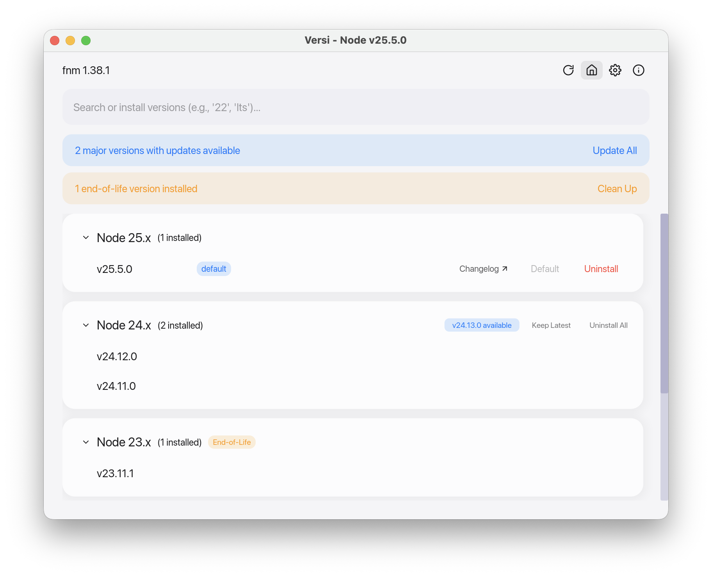

# Versi

Versi is a native desktop app for managing Node.js versions.

It currently supports multiple backends (`fnm` and `nvm`) through a backend-agnostic architecture, so backend-specific behavior is isolated from the GUI and platform layers.



## Features

- Manage installed Node.js versions with install, uninstall, set-default, and use actions
- Backend selection and detection during onboarding (`fnm` and `nvm`)
- Bulk operations: update majors, remove EOL versions, keep only latest per major
- Shell integration setup and verification
- Environment-aware management (native + WSL on Windows)
- Search, filtering, and grouped version lists
- Light/dark theme support with system preference integration
- System tray support with quick actions
- In-app update checks and platform-specific self-update flow

## Installation

### Download Pre-built Binaries

Download the latest release for your platform from the [Releases](https://github.com/almeidx/versi/releases) page.

| Platform | Download |
|----------|----------|
| macOS (Apple Silicon) | `versi-macos-arm64.zip` |
| macOS (Intel) | `versi-macos-x64.zip` |
| Windows (x64) | `versi-windows-x64.msi` |
| Linux (x64) | `versi-linux-x64.zip` |
| Linux (ARM64) | `versi-linux-arm64.zip` |

### macOS Installation

1. Download the appropriate `.zip` file for your Mac.
2. Extract the archive.
3. Run the install script (recommended):
   ```bash
   ./install.sh
   ```
   This removes quarantine attributes and moves `Versi.app` to your Applications folder.

Manual install:
- Drag `Versi.app` to `/Applications`.
- If macOS blocks first launch:
  ```bash
  xattr -cr "/Applications/Versi.app"
  ```
  Or right-click the app and choose "Open".

### Windows Installation

1. Download `versi-windows-x64.msi`.
2. Run the installer.
3. Launch Versi from the Start Menu.

### Linux Installation

1. Download the appropriate `.zip` file.
2. Extract:
   ```bash
   unzip versi-linux-x64.zip
   ```
3. Move the binary to your `PATH`:
   ```bash
   sudo mv versi /usr/local/bin/
   ```
4. Optional desktop entry:
   ```bash
   mv dev.almeidx.versi.desktop ~/.local/share/applications/
   ```

## Build from Source

### Prerequisites

- [Rust](https://rustup.rs/) stable toolchain with Rust 2024 edition support
- Linux only: GTK/AppIndicator dev libraries
  ```bash
  sudo apt-get install -y libgtk-3-dev libayatana-appindicator3-dev
  ```

You do not need `fnm`/`nvm` installed to build. At runtime, Versi will detect configured backends and guide setup via onboarding.

### Build Steps

```bash
git clone https://github.com/almeidx/versi.git
cd versi
cargo build -p versi --release
```

Binary output:
- `target/release/versi`

## Usage

1. First launch: select a backend and complete setup if needed.
2. Main view: browse installed versions grouped by major.
3. Install: use the install flow to fetch available versions.
4. Set default / use: set shell default or activate a version.
5. Uninstall: remove versions with confirmation for destructive actions.
6. Bulk actions: update majors or clean old/EOL versions.
7. Settings: theme, shell integration, launch options, logging.

## Development

### Workspace Layout

```
versi/
├── crates/versi/          # Main Iced GUI app
├── crates/versi-backend/  # Backend traits + shared types
├── crates/versi-core/     # Shared logic (updates, schedule, metadata)
├── crates/versi-fnm/      # fnm backend implementation
├── crates/versi-nvm/      # nvm backend implementation
├── crates/versi-shell/    # Shell detection/config helpers
└── crates/versi-platform/ # Platform abstractions
```

### Common Commands

```bash
# Run app
cargo run -p versi

# Build/check
cargo build --workspace
cargo check --workspace

# Tests
cargo test --workspace

# Format
cargo fmt --all
cargo fmt --all -- --check

# Lint (local strict mode used in CI)
cargo clippy --workspace --all-targets --all-features -- -D warnings
```

### Architecture

Versi uses [Iced](https://iced.rs/) with Elm-style state management:
- `State`: data model (`crates/versi/src/state/`)
- `Message`: event types (`crates/versi/src/message.rs`)
- `Update`: message handling (`crates/versi/src/app/`)
- `View`: pure rendering (`crates/versi/src/views/`, `crates/versi/src/widgets/`)

Message dispatch is split into navigation, operations, settings, and system routing modules under `crates/versi/src/app/update/`.

For contributor and agent-facing details, see [AGENTS.md](AGENTS.md).

## Runtime Requirements

- At least one backend available (`fnm` or `nvm`) for version management
- Shell integration configured for full command-line behavior

## Contributing

1. Fork and branch.
2. Implement changes with tests.
3. Run formatting, tests, and clippy.
4. Open a PR.

## License

GNU General Public License v3.0. See [LICENSE](LICENSE).

## Acknowledgments

- [fnm](https://github.com/Schniz/fnm)
- [nvm](https://github.com/nvm-sh/nvm)
- [Iced](https://iced.rs/)
